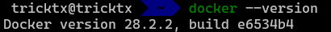
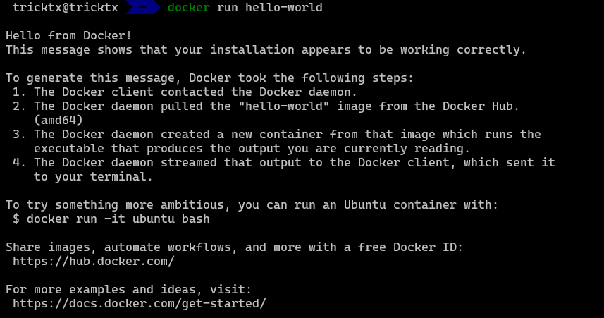
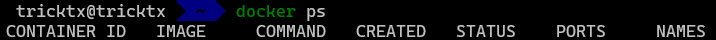
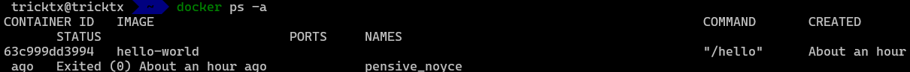
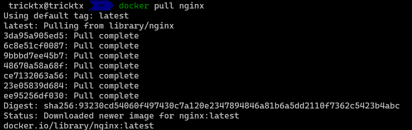
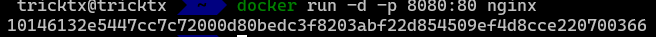
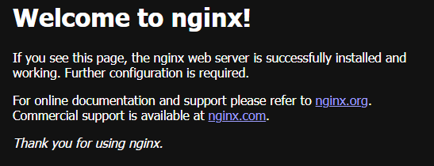
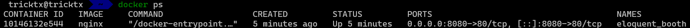
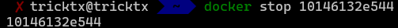
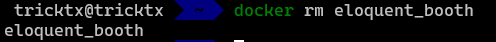

# Primeiros Passos:
---

Iremos utilizar nossos primeiros comandos do Docker após ter instalado.

1. Verifique se o Docker foi instalado corretamente:

```
docker --version
```
O output será a versão que o Docker está buildado no seu computador, segue abaixo um exemplo:


2. Crie o seu primeiro container:
```
docker run hello-world
```

Dessa forma, iremos criar nosso primeiro container. O Docker irá retornar uma imagem de Boas Vindas e informando algumas instruções interessantes, como que a instalação ocorreu perfeitamente e os caminhos que o Docker fez para a criação do container, segue abaixo um exemplo:


---

2. Listando os containers executados e ativos.

Para você ter verificar qual containers está sendo virtualizado no momento, basta rodar o seguinte comando:
```
docker ps
```


No nosso caso, não irá retornar nada, uma vez que o hello-world imprime as mensagens de boas vindas e as instruções. Caso quisermos ver o que foi realmente criado, devemos rodar o comando com a flag `-a`.

```
docker ps -a
```


---

3. Listando images
Caso queira verificar qual imagem está disponível, rode o seguinte comando:

```
docker images
```
---

4. Excluindo contrainers

Para excluir um containers, podemos rodar um dos seguintes comandos
```
docker rm <CONTAINER_ID>
docker rm <CONTAINER_NAME>
```

---

5. Baixando uma imagem

Para baixar uma mensagem docker já definida, podemos utilizar:

```
docker rm <IMAGE_NAME>
```

6. Parar um container

Se quisermos parar um container, basta rodar o seguinte comando:

```
docker stop <CONTAINER_ID>
```

---

7. Excluindo imagens
Podemos ter excluido o container, agora precisamos excluir a imagem. basta rodar o seguinte comando:

```
docker rmi <IMAGE_NAME>
docker image rm <IMAGE_NAME>
```


--- 

## Exercício 1:

Criar um container do Nginx, acessar pelo navegador e remover o container.


### Resolução:

1. Primeiro, crie o container Nginx
1.1 - Baixe o container
    ```
    docker pull nginx
    ```

    output:

    

    1.2 - Execute o container baixado

    ```
        docker run -d -p 8080:80 nginx
    ```
    Observação: a flag `-d` tem como objetivo rodar em background e a flag `-p` publica a porta de um container no host.
    Caso queira ler mais sobre as flags, leia:
    1. https://docs.docker.com/reference/cli/docker/container/run/
    2. https://cursos.alura.com.br/forum/topico-docker-run-flags-t-i-d-restart-p-263536
    
    output:
    

2. Acesse pelo navegador e garanta que esteja funcionando

    Acesse `http://localhost:8080/` no navegador e o resultado será esse: 
    

4. Remova o container
4.1 - Primeiro, iremos verificar os container que temos através do seguinte comando:

    ```
    docker ps
    ```
    `output:` 
    

    4.2 - Dessa forma, precisamos parar o container primeiro

    ```
    docker stop 10146132e544
    ```
    `output:`
    

    4.3 - Por último, excluir o container

    ```
    docker rm eloquent_booth
    ```
    `output:`
    
